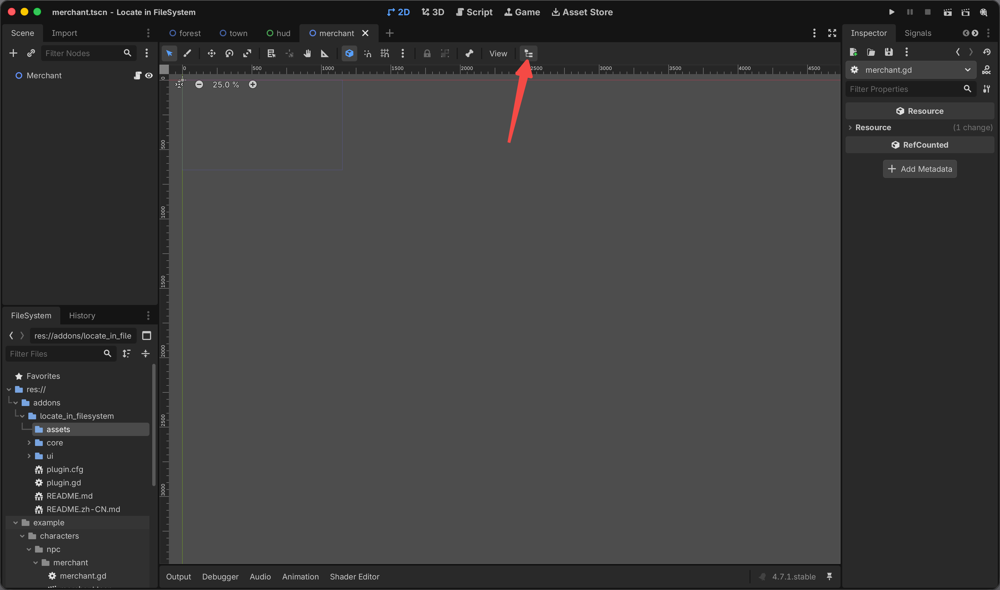
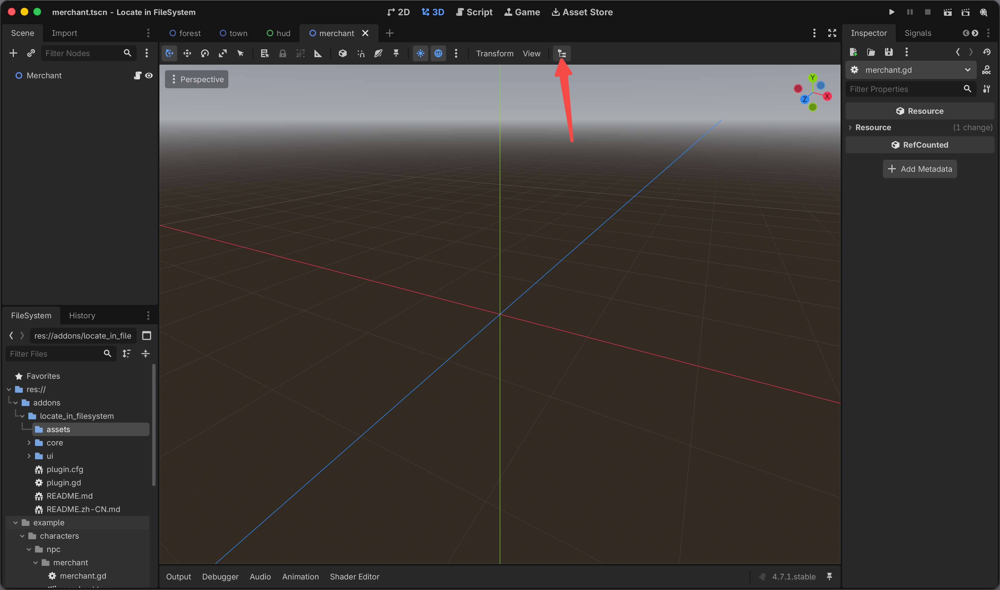
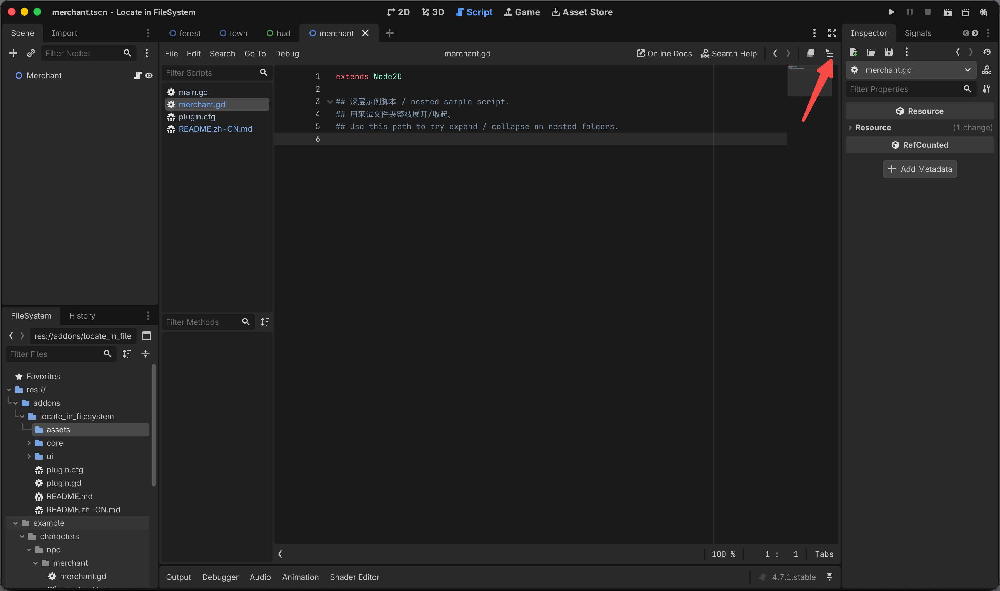
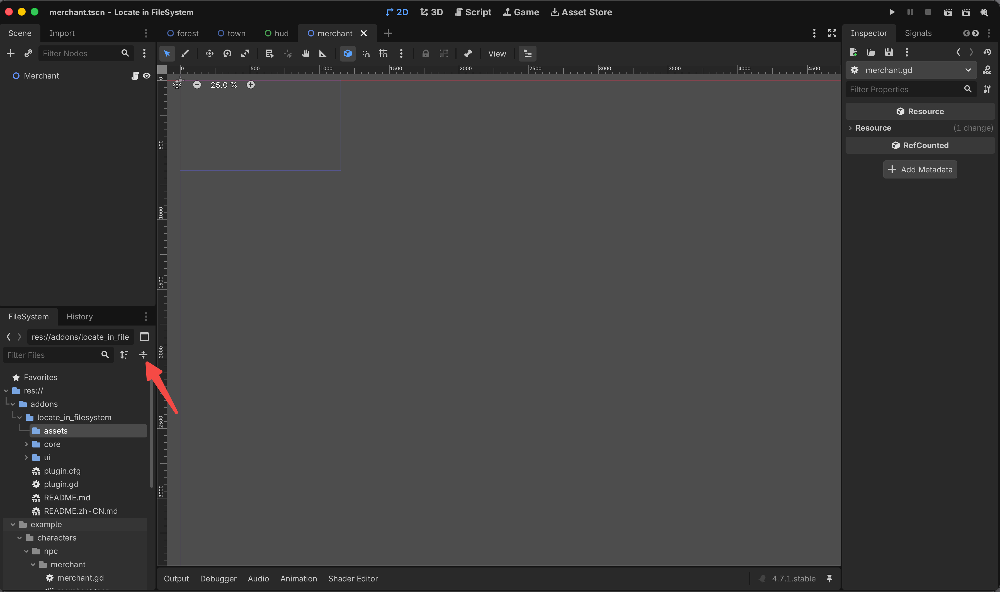

# Locate in FileSystem

[中文文档](README.zh-CN.md)

Godot 4 editor plugin: jump FileSystem to the scene or script you are editing, then expand or collapse that folder branch.

**Requires Godot 4.0+.** No extra dependencies.

## Features

In large projects, FileSystem trees often run 10+ folders deep. Scrolling to a file is slow. Search can match a name quickly, but it still will not show where that file sits in the project tree — the path context is missing.

This plugin jumps FileSystem to the scene or script you are editing, then expands or collapses that folder branch, so path and structure show up together.

### Locate

Open the scene or script you are working on, click **Filesystem** in the toolbar, or press **Ctrl+Shift+L** (macOS: **Cmd+Shift+L**). FileSystem selects that file.

- **2D / 3D**: prefers the edited scene; falls back to the current script.
- **Script**: prefers the current script; falls back to the edited scene.
- Built-in scripts (`scene.tscn::xxx`) locate the host `.tscn`.

2D toolbar:



3D toolbar:



Script editor (no official container; the button sits on the script menu bar):



You can also use Project → **Locate in FileSystem**.

### Expand / collapse

Button next to **Sort Files** in the FileSystem dock. Uses the selected folder (or the parent if a file is selected):

1. Folder collapsed → expand it and instantiated children
2. Expanded subfolders remain → collapse children only
3. Only one level open → collapse the folder itself

Unopened deep folders have no `TreeItem` yet; only instantiated nodes are changed.



## Layout

`plugin.gd` is a facade: it owns services, mounts toolbars, and forwards editor lifecycle. Logic lives in `core/` and `ui/`.

```
plugin.gd                 facade
core/
  file_service.gd         locate current scene / script
  folder_service.gd       expand / collapse selected folder
  editor_utils.gd         find unofficial editor widgets (icons / metadata, not translated text)
ui/
  file_toolbar.gd         2D / 3D / Script locate buttons
  folder_toolbar.gd       fold button next to Sort Files
```

## Install

1. Copy `addons/locate_in_filesystem` into your project.
2. Project → Project Settings → Plugins → enable **Locate in FileSystem**.

## Demo

The standalone example project (`example/`) has nested scenes and scripts so you can try locate and fold.
