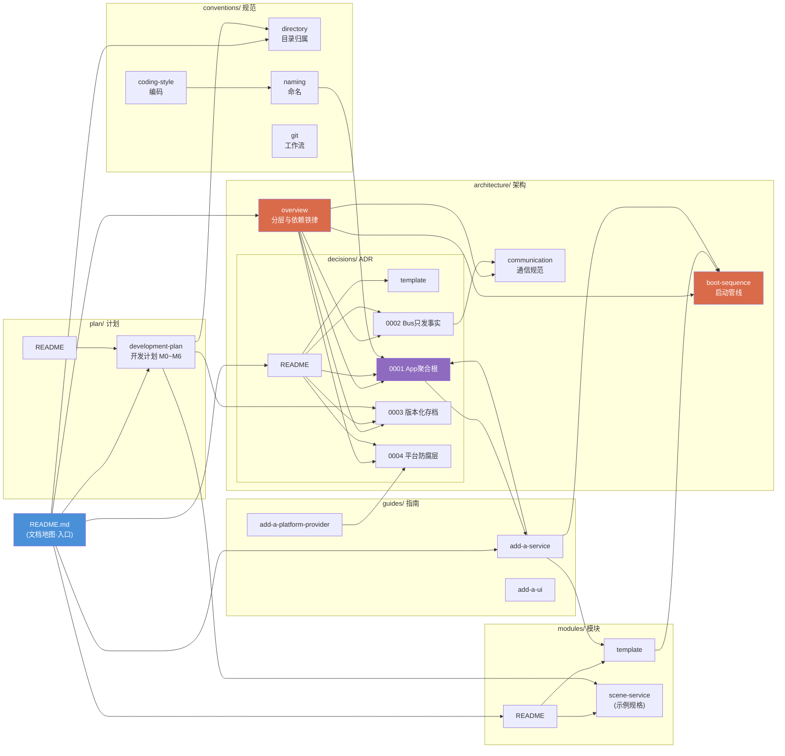

# 文档网络图谱

> status: active | 最后更新: 2026-07-04

节点 = 文档,箭头 = Markdown 链接引用(A → B 表示 A 引用了 B)。用于快速判断:改一篇文档会波及谁、新人该从哪个枢纽读起。



## 枢纽文档(被引用最多,改动需谨慎)

| 文档 | 入度 | 被谁引用 |
|---|---|---|
| ADR-0001 App 聚合根 | 4 | overview、ADR 索引、naming、add-a-service |
| boot-sequence 启动管线 | 3 | overview、模块模板、add-a-service |
| ADR-0003 版本化存档 | 3 | overview、ADR 索引、开发计划 |
| ADR-0004 平台防腐层 | 3 | overview、ADR 索引、add-a-platform-provider |

改这些文档时,顺着入边把引用方检查一遍。

## 孤岛文档(无任何入链,只能靠目录浏览发现)

- `conventions/git.md`
- `guides/add-a-ui.md`

孤岛不是错误(README 的文档地图按目录指路),但新增文档时留意:**如果一篇文档既无入链、又不在任何索引表里,它就等于不存在。**

## 维护规则

1. 新增文档或增删跨文档链接时,同步更新本图谱
2. 重新提取真实链接关系,用此命令核对(在 `docs/` 下运行):
   ```bash
   for f in $(find . -name '*.md' | sort); do
     grep -oE '\]\([^)#]+\.md\)' "$f" | sed "s|](\(.*\))|$f -> \1|"
   done
   ```
3. 图谱与实际链接不符时,以实际链接为准修图,不要为了图好看而改文档结构
